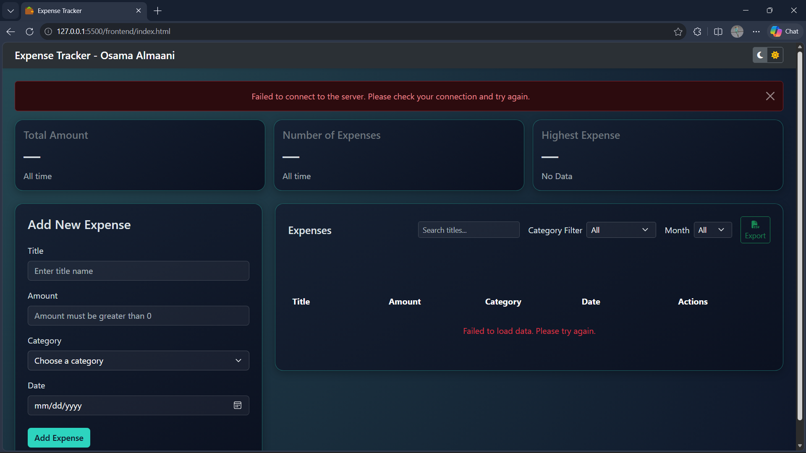
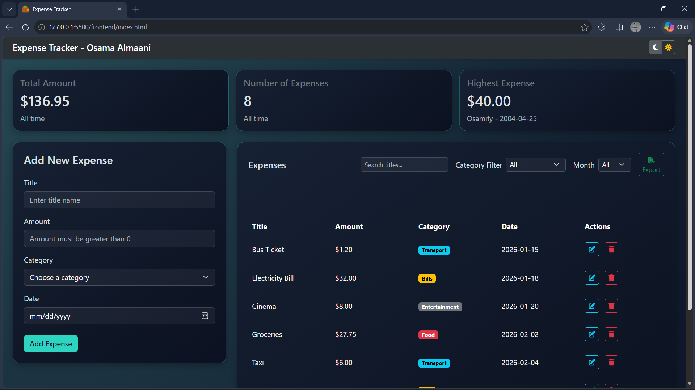
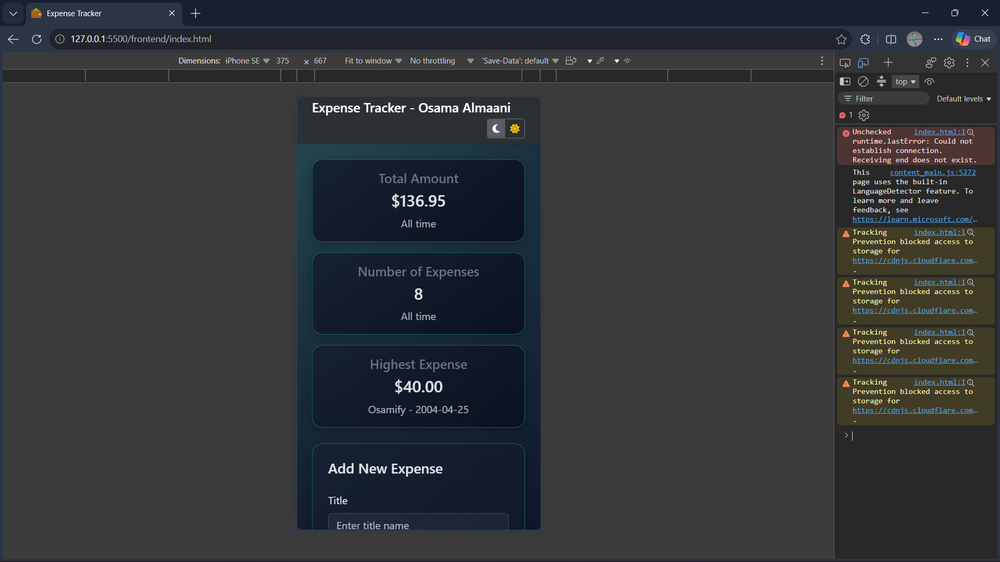
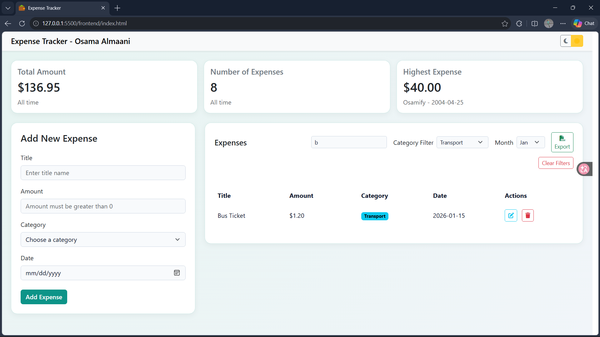

# Expense Tracker

Expense Tracker is a web application that allows the user to insert new expenses and track all his expenses through a sophisticated table. The user can see the total amount, number of expenses, and highest expense details. The user can also edit or delete expenses, and extract a CSV file.

## How to run

**Backend**

1. Open pgAdmin and create a new database named expense_tracker.
2. Open the Query Tool for this new database, paste the contents of the backend/schema.sql file, and execute it to      build the tables and insert sample data.
3. In the backend folder, copy the .env.example file and rename it to .env. Open it and add your PostgreSQL password.
4. Open a terminal inside the backend folder and run npm install to install the required packages.
5. In the same terminal, run node server.js to start the server. Leave this terminal running.

**Frontend**

1. Open the frontend folder in VS Code.
2. Right-click the index.html file and select Open with Live Server.

## Features

- [x] Add an expense (with validation)
- [x] Delete an expense
- [x] Edit an expense
- [x] Filter by category
- [x] Summary cards (total, count, highest)
- [x] Data is saved in a PostgreSQL database
- [x] Bonus: Filter by month and search by title
- [x] Bonus: Sort the table by clicking a column title
- [x] Bonus: Export the expenses as a CSV file
- [x] Bonus: Dark mode

## Screenshots

## What was the hardest part?

The most difficult challenge was managing the deeply nested HTML structure required by Bootstrap. Aligning responsive elements often meant nesting multiple div containers for rows, columns, and flexbox utilities, which complicated the DOM tree. I overcame this through consistent practice, experimenting with different layout structures, and building familiarity with Bootstrap's grid system behavior.